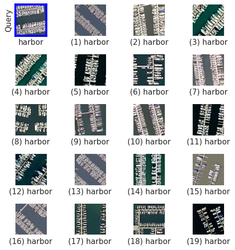
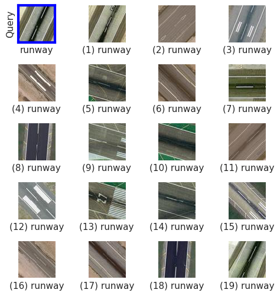
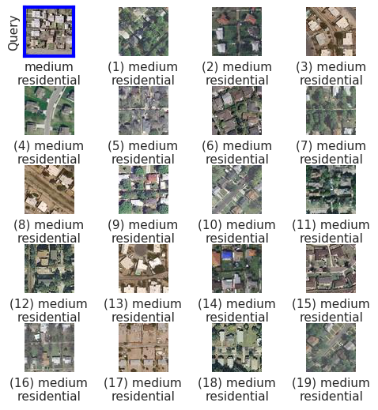
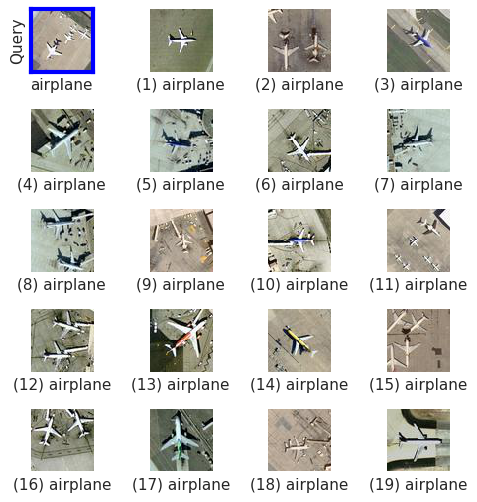

# MHCLN - Deep Metric and Hash Code Learning Network

Code for [paper](https://www.igarss2018.org/Papers/viewpapers.asp?papernum=3006) 
**DEEP METRIC AND HASH-CODE LEARNING FOR CONTENT-BASED RETRIEVAL OF REMOTE SENSING IMAGES** 
accepted in the International Conference on Geoscience and Remote Sensing Symposium (**IGARSS**) 
to be held in *Valencia, Spain* in July, 2018.

# Overall Architecture of MHCLN

# Prerequisites
- Python 2.7
- Tensorflow GPU 1.2.0
- Scipy 1.1.0
- Pillow 5.1.0

**N.B.** The code has only been tested with Python 2.7 and Tensorflow GPU 1.2.0. Higher versions of the software should also work properly.

In our paper we have experimented with two remote sensing benchmark archives - [**UC Merced Data Set**](http://weegee.vision.ucmerced.edu/datasets/landuse.html) (UCMD) and [**AID**](https://arxiv.org/abs/1608.05167). Code for the respective data sets have been provided in separate folders.

# Usage
First, download [UCMD](http://weegee.vision.ucmerced.edu/datasets/landuse.html) dataset or the [AID]() dataset and save them on the disk. For the UCMD dataset the parent folder will contain 21 sub-folders, each containing 100 images for each category. Whereas, for the AID dataset the parent folder will contain 30 sub-folders, cumulatively containing 10,000 images.

Next, download the pre-trained Tensorflow models following the instructions in [this](https://www.tensorflow.org/tutorials/image_recognition) page.

To extract the feature representations from a pre-trained model:   
  `$ python extract_features.py \`  
    `--model_dir=your/localpath/to/models \`  
    `--images_dir=your/localpath/to/images/parentfolder \`  
    `--dump_dir=dump_dir/`  

To prepare the training and the testing set:  
  `$ python dataset_generator.py --train_test_split=0.6`
  
To train the network. It is to be noted that same `train_test_split` should be used as above:  
  `$ python trainer.py\`  
  `--HASH_BITS=32 --ALPHA=0.2 --BATCH_SIZE=90\`  
  `--ITERS=10000 --train_test_split=0.6`

To evaluate the performance and save the retrieved samples: 
  `$ python eval.py --k=20 --interval=10`

# Retrieval Results  
Retrieval results for some sample query images. The query is enclosed by the blue box. The retrieved images are sorted in decreasing order of *proximity* or *semantic similarity* from the query image. Top 19 results are displayed.  

## UCMD  

Query - Harbour             |  Query - Runway 
:-------------------------:|:-------------------------:
  |    

Query - Medium Residential             |  Query - Airplane 
:-------------------------:|:-------------------------:
  |  
