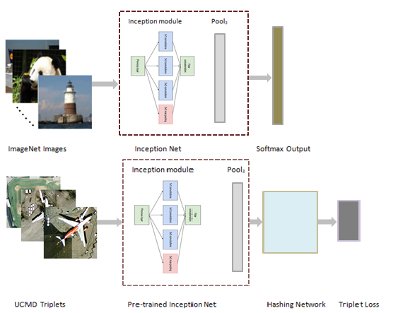

# MHCLN - Deep Metric and Hash Code Learning Network

Code for [paper](https://www.igarss2018.org/Papers/viewpapers.asp?papernum=3006) 
**DEEP METRIC AND HASH-CODE LEARNING FOR CONTENT-BASED RETRIEVAL OF REMOTE SENSING IMAGES** 
accepted in the International Conference on Geoscience and Remote Sensing Symposium (**IGARSS**) 
to be held in *Valencia, Spain* in July, 2018.

# Overall Architecture of MHCLN

# Prerequisites
- Python 2.7
- Tensorflow GPU 1.2.0
- Scipy 1.1.0
- Pillow 5.1.0

**N.B.** The code has only been tested with Python 2.7 and Tensorflow GPU 1.2.0. Higher versions of the software should also work properly.

In our paper we have experimented with two remote sensing benchmark archives - [**UC Merced Data Set**](http://weegee.vision.ucmerced.edu/datasets/landuse.html) (UCMD) and [**AID**](https://arxiv.org/abs/1608.05167)

# Usage
First, download [UCMD](http://weegee.vision.ucmerced.edu/datasets/landuse.html) dataset and save them on the disk. The parent folder will contain 21 sub-folders, each containing 100 images for each category.

Next, download the pre-trained Tensorflow models following the instructions in [this] (https://www.tensorflow.org/tutorials/image_recognition) page.

To extract the feature re-presentations from a pre-trained model:   
  `$ python extract_features.py \`  
    `--model_dir=your/localpath/to/models \`  
    `--images_dir=your/localpath/to/images/parentfolder \`  
    `--dump_dir`  

